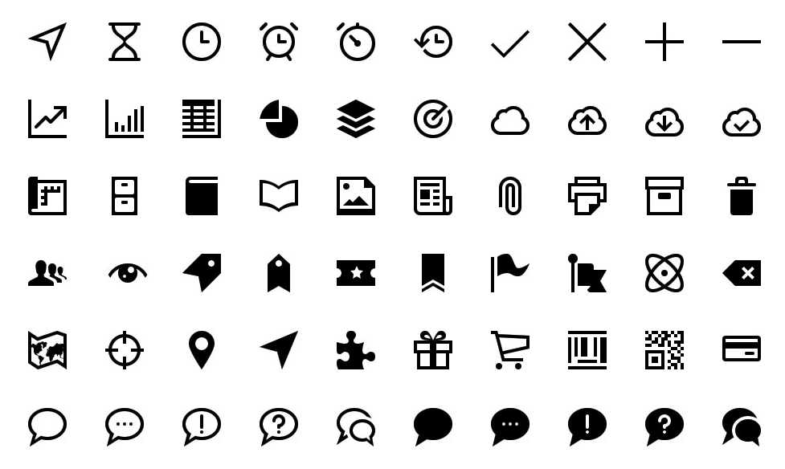
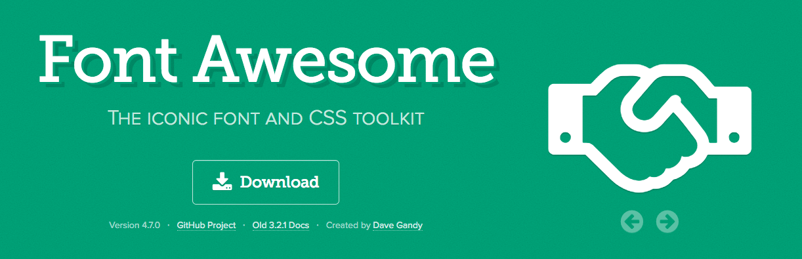
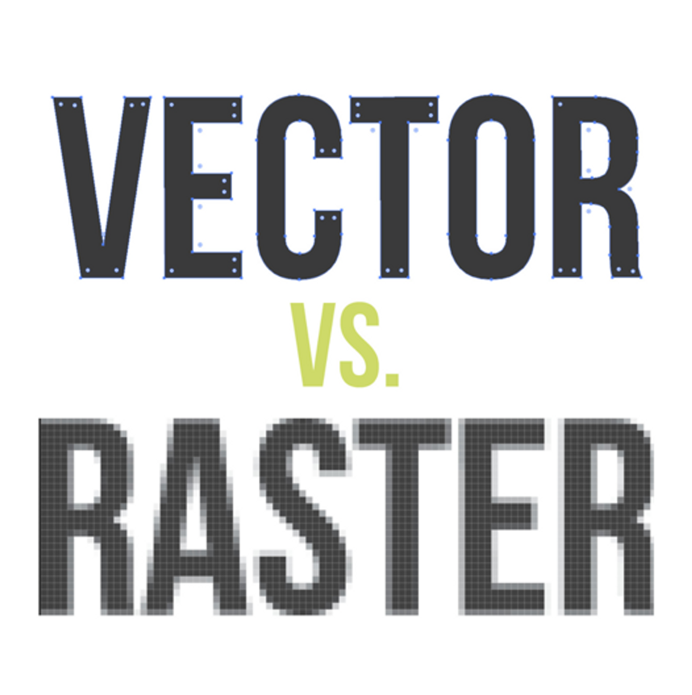

**아이콘**이 없는 웹이나 앱 서비스는 찾기 어렵다. 
특히 모바일 앱에서는 한정된 스크린에서 
정확한 콘텍스트를 명시하면서도 액션을 담은 아이콘은 필수적이다. 

물론 [햄버거 메뉴와 같은 부작용](http://story.pxd.co.kr/1131)도 있는데, 
햄버거 메뉴가 UX에 도움이 되지 않는다는 
비판의 목소리가 나오기도 했다. 

하지만 오늘 말하고자 하는 문제는 **개발 단계에서 아이콘 자체의 유지・관리에 대한 문제**이다.

웹에서 아이콘을 표현하는 방법은 웹의 발전과 함께 변화되었다. 
포토샵에서 이미지를 슬라이스해, 용량이 낮은 gif 포맷의 이미지를 하나씩 넣는 것부터, 
하나의 리소스를 사용하는 sprite image, 
아이콘 폰트, SVG까지 아이콘을 표현하는 방법이 발전했다. 
최근에 가장 자주 사용되는 방법은 아이콘 폰트로 보인다.



## 아이콘 폰트

나도 본인 또한 아이콘 폰트를 선호하는 입장이었는데, 
가장 유명한 아이콘 폰트 라이브러리인 [font-awesome](notion://www.notion.so/cnaa97/fontawesome.io) 이나 
[Material Design Iconic Font](https://zavoloklom.github.io/material-design-iconic-font) 을 주로 사용했다.  

그러나 최근 [Github에서 기존의 아이콘 폰트를 모두 걷어내고 SVG를 사용한다는 글](https://www.reddit.com/r/web_design/comments/47sdsy/github_delivering_octicons_with_svg_and_some_of/)을 보았는데, 
아이콘 폰트는 일종의 hack 으로 간편한 사용으로 널리 퍼지긴 했지만, 여러 문제가 드러났다.



먼저 랜더링 이슈가 있었는데, 
아이콘 자체의 소스는 벡터 그래픽 기반이긴 하지만 
아이콘이 텍스트로 전달되기 때문에 
웹킷 기반의 브라우저에서는 흐릿해보일 수 있다.

제작이 용이하지 않다는 점도 큰 단점이다. 
이미 정의된 디자인을 사용할 때는 font-awesome과 같은 서비스가 유용하지만, 
커스텀한 아이콘 폰트를 제작하기 위해서는 폰트 제작 서비스에 의존해야 하며, 
추가 삭제를 자동화하기 어렵고, 번거롭다. 

여러 라이브러리가 있지만, [Fontello](http://fontello.com/)를 사용해보았는데, 
이곳에서 자신의 SVG 파일을 업로드하고, 폰트와 CSS 코드를 다운받을 수 있다. 

이곳에서 config 파일을 제공하지만, 
새로운 아이콘을 추가 하기 위해서는 웹 기반의 UI 에서 SVG 리소스를 추가해야 한다. 
일회성으로 사용되는 프로젝트에는 용이할 수 있지만, 
지속적으로 유지 관리해야하는 관점에서는 적절하지 않아 보인다.

## 아이콘, 가장 효율적인 사용 방법은 무엇일까

제품의 디자인을 지속적으로 업데이트하는 과정에서 새로 추가된 아이콘을 통합 관리해야 하는 단계에 진입하면서 아이콘에 대해서 깊게 고민해보게 되었다. 기존의 sprite image를 활용한 방식은 아이콘이 추가될 때마다 이미지 원본과, CSS 코드를 수정해주어야 하는 번거로움이 있었다. 아이콘의 색상도 이미지 편집으로 지정해야하는 것도 큰 단점이다. 위에서 언급한 바와 같이 아이콘 폰트의 경우에도, 새 아이콘이 추가될 때마다 폰트를 새로 만들어야 하고, config 파일이 바뀌면서 해당 아이콘을 참조하는 name space가 변화되는 경우도 발생했다. 결국 SVG 를 직접 적용하는 방향을 선택하게 되었다.

## SVG 아이콘

SVG는 2차원 벡터 그래픽을 표현하기 위한 XML 기반의 파일 형식으로, 1999년 W3C 주도하에 개발된 오픈 그래픽 표준이다. 때문에 IE8 이전 버전을 제외한 대부분의 브라우저에서 지원된다. 사이즈가 변화함에 따라 깨지지 않는 png, jpg 등의 레스터 이미지와는 달리, SVG는 벡터 기반이기 때문에 사이즈 변화에 전혀 지장이 없다.



코딩을 모르던 시절부터 10년 이상 그래픽 툴을 다루어, 편집 툴에 익숙한 만큼, SVG 포맷은 왠지 익숙한 느낌이었는데, SVG 문법과 코드를 이해하게 되면서 디자인된 결과물들이 사실은 바이너리 코드로 이루어져 있다는 사실을 새삼 다시 느꼈다.

## SVG 아이콘의 장점

SVG 를 아이콘 폰트가 아닌 바로 사용하게 되면, 여러 장점이 있다.

1. 브라우저 호환성
2. SVG 의 속성을 그대로 사용할 수 있음 (defs, fill 등)
3. 디자인 파일과 코드 동시 관리

조사하는 과정에서 SVG 를 웹에 표현할 수 있는 방법이 여러가지임을 알게 되었는데, 브라우저 호환성 등 다양한 조건을 만족하면서도 디자이너부터 받은 아이콘을 손쉽게 유지・관리 하면서도 개발적으로 효율적으로 적용할 수 있어야 한다. 위에서 언급했던 Github의 웹은 루비온레일즈로 개발되었기 때문에 DOM 내에

```
<%= octicon(:symbol => "plus") %>
```

이런 식으로 루비 코드를 삽입해서 사용할 수 있었다. HTML에서의 결과물은

```
<svg></svg>
```

로 나타난다. 결국 나는 프로젝트에 맞는 SVG를 효율적으로 웹에 적용하는 다른 방법을 모색하게 되었다.

<br/>

## SVG 용량 문제
복잡한 SVG 아이콘의 경우 기본적으로 path 가 굉장히 길게 나타나는데,

[SVGO](https://github.com/svg/svgo)는 SVG 파일의 path 중 불필요한 vertex를 삭제하면서 최적화할 수 있는 프로젝트이다. 이 외 여러 툴로 SVG 파일을 최적화 할 수 있다.

<br/>

## SVG 적용

### Sprites SVG

기존의 Sprite 이미지를 사용한 아이콘 구현 방법과 유사하다. 그러나 sprite image와 같이 SVG 아이콘을 하나로 모으면 수정 시 그리드를 벗어날 경우, 화면에 출력될 좌표에 문제가 생길 수도 있는 위험이 있다. SVG 아이콘 파일을 CSS의

```
background-image
```

로 적용해보았다.

#### CSS
```css
.icon {
  width: 48px;
  height: 48px;
  background: url(sprite-icons.svg) no-repeat;
  background-size: cover;
  display: inline-block;
}

/*
** CSS 사용
*/
.icon-red    { background-position: 50% 0; }
.icon-orange { background-position: 50% 20%; }
.icon-yellow { background-position: 50% 40%; }
...
.icon-black  { background-position: 50% 160%; }

/*
** SCSS 사용
*/
$i: 100%/20; // Number of Icons minus 1
.icon-red    { background-position: 50% 0; }
.icon-orange { background-position: 50% $i * 1; }
.icon-yellow { background-position: 50% $i * 2; }
...
.icon-black  { background-position: 50% $i * 10; }
```

```html
<i class="icon icon-orange"></i>
```

### CSS Masks
background 의 경우 배경 이미지 색을 바꿀 수 없는데, SVG 고유의 fill 등을 지정할 수 없다. 다행히 CSS 마스크를 통해 배경 색을 변경할 수 있는 방법이 있다. SVG 아이콘의 형태를 그대로 특정 색으로 오버레이하는 식이다.

```css
.icon {
  width: 48px;
  height: 48px;
  -webkit-mask-image: url(icons.svg);
  mask-image: url(icon.svg);
  background-color: gray; /* 기본 아이콘 색상 */
}

.icon-red { background-color: red; }
.icon-green { background-color: green; }
.icon-blue { background-color: blue; }
```

```html
<i class="icon icon-red"></i>
```

그러나 IE 에서도 사용 할 수 없기 때문에 적절한 방법이 아닌 것으로 판단되었다.

<br/>

### CSS Preprocessor - SASS

SASS의 함수를 이용해서 자체적으로 각 CSS 클래스에 맞게 SVG를 구현하는 방법도 있었다.

```scss
@function _buildIcon($icon) {
  $icon: '<svg xmlns="http://www.w3.org/2000/svg" xmlns:xlink="http://www.w3.org/1999/xlink" width="24" height="24">#{$icon}</svg>';
  @return $icon;
}

@function icon(
  $icon-name,
  $color,
  $stroke-color: transparent,
  $stroke-width: 0,
  $css: '' // arbitrary css
  ){
  $icons: (
    home: '<path fill="#{$color}" stroke="#{$stroke-color}" stroke-width="#{$stroke-width}" style="#{$css}" d="M10 20v-6h4v6h5v-8h3l-10-9-10 9h3v8z"/>',
    heart: '<path fill="#{$color}" stroke="#{$stroke-color}" stroke-width="#{$stroke-width}" style="#{$css}" d="M12 21.35l- ... 1.45 1.31z"/>',
);
  $icon: _buildIcon(map-get($icons, $icon-name));
  @return url('data:image/svg+xml;utf8,#{$icon}');
}

.icon {
  display: inline-block;
  font-size: 0;
  width: 50px;
  height: 50px;
  margin: 0 auto;
  background-size: cover;
  background-repeat: no-repeat;
  background-position: 50% 50%;
}

.icon-home { background-image: icon(home, green); }
.icon-heart { background-image: icon(heart, red); }
```

```html
<i class="icon icon-home"></i>
<i class="icon icon-heart"></i>
```

위 방법의 경우 SVG 파일의 path만 따로 분리해서 SCSS에 저장 해야 하고, 굉장히 긴 `path` 의 `d` 속성을 SCSS 파일 내부에서 관리해야 되기 때문에 번거롭고 가독성도 좋지 않다. 참신한 hack 이지만, 적절한 방법이 아니라고 판단했다.

<br/>

### Inline SVG

인라인 SVG의 아이디어는 심플하다. SVG의 element 중 하나인, `defs` 를 사용하는 방법이다. `defs` 는 클래스와도 유사한 개념인데, 특정한 스타일이나 형태를 보관해놓는 곳이라고 보면 된다. document 에 랜더링되지 않고, 미리 스타일을 정의해두는 방법이다. `symbol`은 여러 구성의 형태를 하나의 셋트로 관리하는 그룹과 유사하다. 각 심볼에 `id`를 지정하고 링크를 걸어 사용할 수 있다.

기본 SVG 코드는 아래와 같다.
```xml
<svg display="none" width="0" height="0" version="1.1" xmlns="http://www.w3.org/2000/svg" xmlns:xlink="http://www.w3.org/1999/xlink">
    <defs>
        <symbol viewBox="0 0 64 64" id="i-add">
            <title>add</title>
            <path d="M30,29.839l0,-27.583c0.004,-0.07 ... ,-0.012l27.744,0Z"></path>
        </symbol>
    </defs>
</svg>
```

위와 같은 화면에 출력되지 않는 SVG 파일을 body 하위에 정의해두고, `xlink:href` 속성에 미리 정의된 `id`를 넣어주는 식으로 사용한다. 사용 방법은 아래와 같다.

```xml
<svg><use xlink:href="#i-add"></use></svg>
```

기존의 방법과 같이 svg 에 class 속성을 넣어 사용할 수도 있다.
```xml
<svg class="i-color-blue"><use xlink:href="#i-angle-up"></use></svg>
```

```css
.i-color-blue {
  fill: blue;
}
```

다만 기존의 `<i>` 태그에 클래스만 바꾸던 문법과 달라 생소할 수는 있으나, 익숙해지면 괜찮다고 판단했다. 깃허브에서도 아이콘을 디버깅해보면 위와 같은 구조의 SVG를 사용하고 있음을 알 수 있었다.


(사진=SVG 파일 ; path 의 d 속성은 굉장히 복잡하다.)

<br/>

## 효율적인 SVG 아이콘 관리
SVG 아이콘을 미리 정의해두고 링크를 걸어 사용하는 것이 굉장히 좋은 방법이지만, SVG path 의 경우 굉장히 긴 경우가 많다. body 하위에 둔다는 것이 부담스러운 일이다. 일일이 SVG 코드를 작성한다는 것은 비효율적인 일이 된다.

그래서 2가지 아이디어를 생각했다.
1. SVG 에서 중요하게 사용되는 `id`와 `path` 값만 모아 변수로 정의해두고, 스크립트로 직접 DOM에 넣어주는 방식
2. node 를 이용해서 SVG가 담긴 디렉토리의 파일을 모두 읽어, `path`만 모아 `defs.svg` 파일을 만들어주는 방식

첫 번째 방법은 디자인 소스 파일과 개발을 분리한다는 점에서 부적절했다. 또한 일일이 SVG파일을 열어서 `path` 의 `d`속성만 찾아 복사하고, 변수에 보관한다는 것이 굉장히 노가다스러운 작업이었다. 다만 한 번만 정의해놓으면 추가적으로 관리하기 용이했기 때문에 시도를 해보았다.

#### **중요**
SVG 아이콘 파일이 있다고 가정하고, 작업을 시작하는데, 여기서 중요한 문제가 있다. 예를들어 일러스트레이터로 아이콘 파일을 디자인하고 나서, 라인과 사각형 등의 모든 형태를 expend 하고, 하나의 path 로 구성시켜야 한다.

<br/>

### path와 id 값만 따로 관리하기

```js
var svgSource = [
    {
        name: "add",
        path: "M30,29.839l0 ... 0.216,-0.012l27.744,0Z"
    },
    ...
    {
        name: "angle-down",
        path: "M3.048,14.417c0. ... 9,0.008 0.209,0.012Z"
    }
];
```

아이콘에 따라 name, path 키를 가진 Object 포맷의 변수만든다. path 의 값은 SVG 파일을 열어 d 속성을 찾아 복사한다.

```js
(function(){
    var body = document.body;
    var svgNS = "http://www.w3.org/2000/svg";

    var svg = document.createElementNS(svgNS, "svg");
    svg.id = 'defs';
    svg.setAttribute('display', 'none');
    svg.setAttribute('width', '0');
    svg.setAttribute('height', '0');

    var defs = document.createElementNS(svgNS, "defs");

    svgSource && svgSource.map(function (item) {
        var symbol = document.createElementNS(svgNS, "symbol");
        symbol.setAttributeNS(null, 'viewBox', '0 0 64 64');
        symbol.id = "i-" + item.name;

        var title = document.createElementNS(svgNS, "title");
        title.innerHTML = item.name;

        var path = document.createElementNS(svgNS, "path");
        path.setAttribute('d', item.path);

        symbol.appendChild(title);
        symbol.appendChild(path);
        defs.appendChild(symbol);
    });

    svg.appendChild(defs);
    body.insertBefore(svg, body.childNodes[0]);
})();
```

위 코드는 해당 변수를 읽고 SVG 코드를 만들어 body 에 prepend 시킨다. 이 코드에서 네임 스페이드 등을 결정한다.

<br/>

## 원본 SVG 파일을 읽고 symbol 로 저장
위 방법의 경우, 결국은 디자인 파일과 개발 코드가 분리되어있고, 번거롭다는 단점이 있다. 결국은 SVG 파일을 모두 읽고 자동화시켜야 한다. 두 번째 방법은 노드의 파일시스템 모듈로 원본 파일을 읽고, SVG 파일을 생성하는 방법이다. 생성된 파일을 HTML 에서 참조하여 사용하면 된다.

```js
var fs = require('fs');
var xml2js = require('xml2js');
var parser = new xml2js.Parser();

var svgDir = process.argv[2] || './svg';
var outDir = process.argv[3] || './dist';


fs.readdir(svgDir, function(err, files) {
    if (err) {
        return console.log(err);
    }

    var symbols = '';

    files.forEach(function(filename, index) {
        fs.readFile( svgDir + '/' + filename, 'utf-8', function(err, content) {
            if (err) {
                return console.log(err);
            }
            parser.parseString(content, function (err, result) {
                var path = result.svg.path[0].$.d || null;
                var title = filename.substring(0, filename.length - 4); // 확장자 제거

                if (path) {
                    symbols += '<symbol viewBox="0 0 64 64" id="i-'+ title +'"><title>'+ title +'</title><path d="'+ path +'"></path></symbol>'

                    if (index == files.length - 1) {
                        var tempSVG = '<svg id="svgs" version="1.1" xmlns="http://www.w3.org/2000/svg" xmlns:xlink="http://www.w3.org/1999/xlink"  style="display: none;" width="0" height="0"><defs id="defs">'+ symbols +'</defs></svg>';
                        // var tempSVG = '<defs id="defs">'+ symbols +'</defs>';
                        fs.writeFile(outDir + "/defs.svg", tempSVG, function(err) {
                            if(err) {
                                return console.log(err);
                            }
                            console.log("SVG file was saved!");
                        });
                    }
                }
            });
        });
    });
});
```

<br/>

## 사용하기

사용 방법은 아래와 같다. 해당 파일이 위치한 디렉토리를 참조해서 사용하면 된다.

```xml
<svg class="icon"><use xlink:href="../../defs.svg#i-add" /></svg>
```

<br/>

아이콘 하나를 그리기 위해 긴 디렉토리를 사용하고싶지 않은 경우, Ajax 로 데이터를 가져와 body 하위에 넣어줄 수도 있다.

#### 1. d3 라이브러리 사용해서 외부 xml 가져오는 방법

```js
d3.xml("symbols.svg").mimeType("image/svg+xml").get(function(error, xml) {
  if (error) throw error;
  document.body.insertBefore(xml.documentElement, document.body.childNodes[0]);
});
```

#### 2. xhr 로 가져오는 방법

```js
(function () {
    var xhr = new XMLHttpRequest();
    xhr.onreadystatechange = function() {
        if (xhr.readyState === xhr.DONE) {
            if (xhr.status === 200 || xhr.status === 201) {
                var svg = xhr.responseXML.documentElement;
                if(svg) {
                    document.body.insertBefore(svg, document.body.childNodes[0]);
                }
            } else {
                console.error(xhr.responseText);
            }
        }
    };
    xhr.open('GET', '../src/symbols.svg');
    xhr.send();
})();
```
