ChatGPT를 시작으로 여러가지 도구들이 나오고 있다.
검색엔진에 의존하던 개발 업무 방식이 크게 변화하고 있다.

이를 계기로 나도 여러가지 도구를 실제 작업과 학습에 사용해보며, 느낀점을 정리해본다.

## AI 기반 도구

### ChatGPT

- 대화형 인공지능 챗봇이다.
- 다들 알 것 같으니 패스

### Copilot

[GitHub Copilot · Your AI pair programmer](https://github.com/features/copilot)

- 인공지능을 이용한 코드 자동 완성 툴
- GPT-3를 이용해 깃허브의 레포지토리의 코드를 학습시키는 방식으로 구현
- 주석, 함수에 담긴 의미를 파악해 코드를 자동완성
- 비용은 월 10달러, 연 100달러 (연간 플랜 선택 시 2달 무료체험)
- 각종 IDE에서 플러그인 형식으로 사용 가능하다
    - Intellij, vscode 등

### Copilot Lab



[GitHub Next | GitHub Copilot Labs](https://githubnext.com/projects/copilot-labs/)

VSCode 확장 프로그램으로, 좀 더 직관적인 UI를 이용해 Copilot을 활용할 수 있다.

### Copilot X

[Introducing GitHub Copilot X](https://github.com/features/preview/copilot-x)

*2023년 3월에 출시되어, 대기자 목록에 추가했고 아직 사용해보진 못했다.*

- GPT-4 기반 좀 더 향상된 서비스이다.
- 코드 뿐만아니라, 문서까지 확장되었다.
- 대화형 채팅과 같은 검색 인터페이스가 IDE 옆에 달려 있다.
- 내가 작성한 코드를 기반으로, 유닛 테스트를 작성해주기도 한다.
- Github 사용자에 한해서는 PR을 대신 해주기도 한다.

## 실제 개발 작업에 사용해보기

ChatGPT와 Copilot을 실제 업무에 활용해보자.

### E2E 테스트

회사에서는 puppeteer를 이용한 자동화된 테스트케이스를 사용하고 있다.
puppeteer는 잘 만들어진 헤드리스 브라우저 도구지만,
해당 문법과 테스트케이스를 수동으로 작업해야 하는 것은 여전한 문제였다.

테스트 도구를 이쁘게 잘 만들어 놓고, 정작 테스트케이스 채우는건 신경쓰지 못했다.
이 작업을 ChatGPT와 Copilot을 활용해봤다.

전략은 인간의 언어로 코드를 쭉 전달받아 시뮬레이션해보는 것을 반복했다.

기본 시나리오를 먼저 알려주고

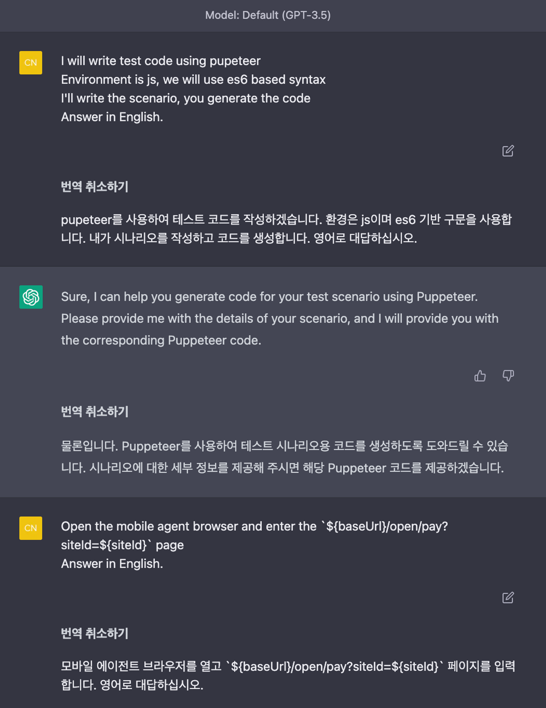

> 페이지에서 `a[href="/open/pay/prepay?siteId=${siteId}"]` 클릭,
요소가 있으면 페이지 이동, 없으면 오류 처리
>

시나리오에 맞게 소스를 생성해준다.

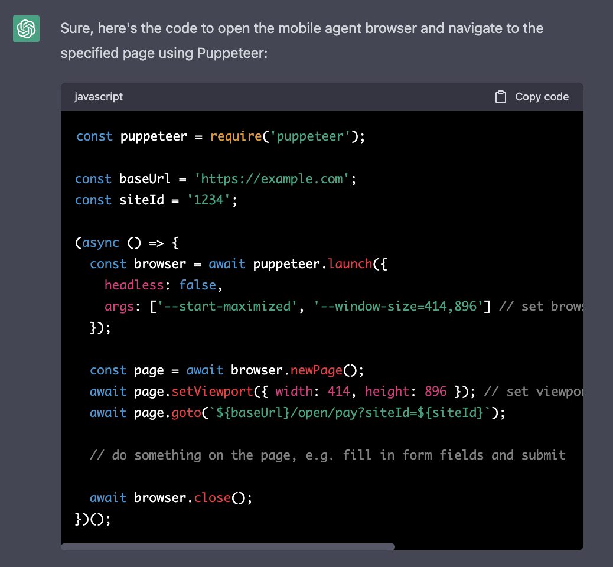

**ESMobule 사용하는 소스로 “바꿔줘”**

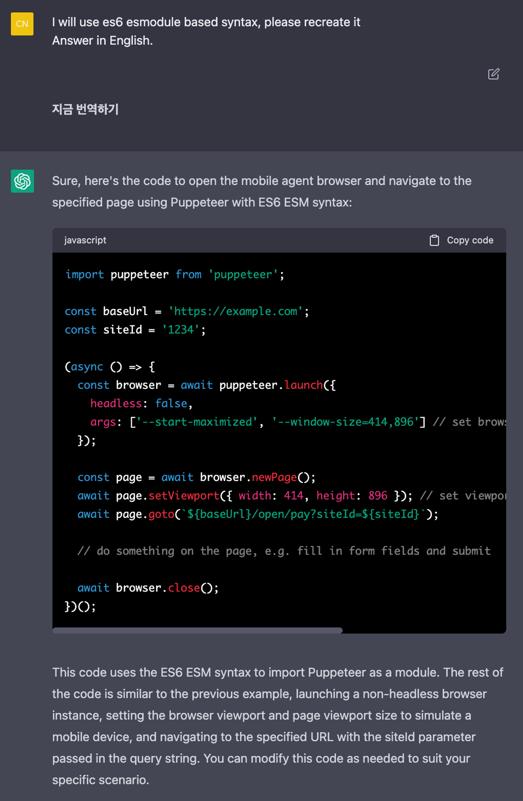

유틸 함수도 필요한데, 알려줬더니, 앞으로 작성해주는 소스에 반영해준다.

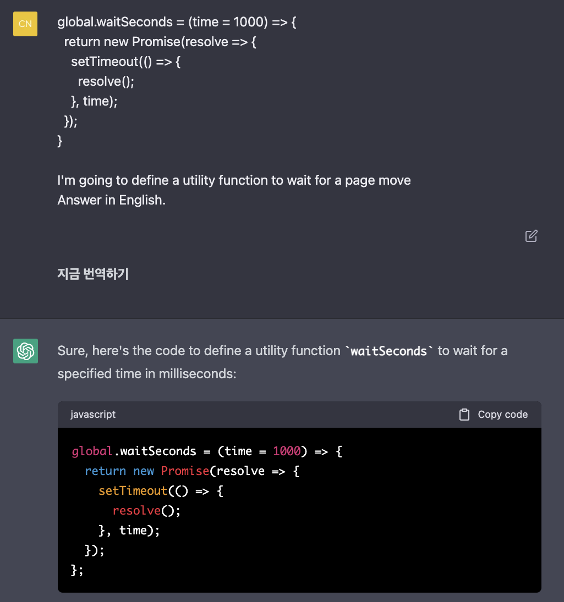

전달받은 코드를 내 컴퓨터에서 돌려보면서 진행했다.



이래저래 작업을 했지만, 생각보다 많이 번거롭다.
버전 문제도 있을거고, 완벽한 시나리오대로 해주진 않는다.
그저 더 좋은 검색엔진으로서 활용 할 뿐이다.

### Remote SSH

원격으로 SSH에 접속하는 클라이언트를 만들어야 했다.
메시지를 주고받으면서 터미널같은 UI를 구성해야 했다.

기본적인 코드는 ChatGPT로 만들었고, 샘플코드를 받았다.



Copilot을 이용해보았다.



- 프론트엔드에서 주석을 기반으로 하는 자동완성 기능은 효용이 많이 떨어진다.
    - 단일 함수가 아닌, 컴포넌트라는 랜더를 위한 함수 하나에 많은 기능이 담기는데,
    - 자동완성으로는 해결하기 어렵다.
- 콘텍스트를 기반으로 하는 자동완성은 (약간의 딜레이가 있지만), 꽤 유용하다.
- 복잡한 컴포넌트 설계에는 ChatGPT가 더 유용했다.
- 오히려 **프롬프트**를 작성하는게 더 불편한 일이 되기도 했다.
    - 프로그래밍이라는 문법을 인간의 문법으로 바꾸어 주는데, 그 반대를 기대하려면 잘 작성해야 한다.

## 잘 모르던 분야에서 활용해보기

아래와 같은 이미지는 종종 봤을 것이다. mnist라고 하는데,
이미지 내의 숫자를 추출하는 머신러닝 분야의 미니 프로젝트이다.

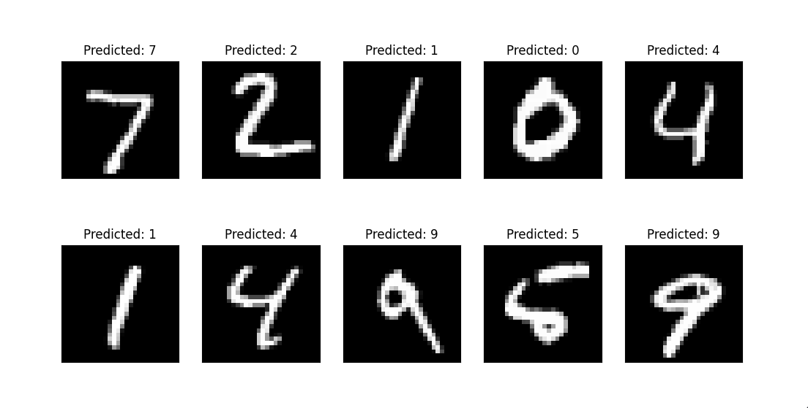

머신러닝의 개념은 기본적인 수준으로 알고있는데, 직접 코딩을 하면서 작업해본적은 없다.
**과연 잘 모르는 분야에서 도움을 받을 수 있을까?**

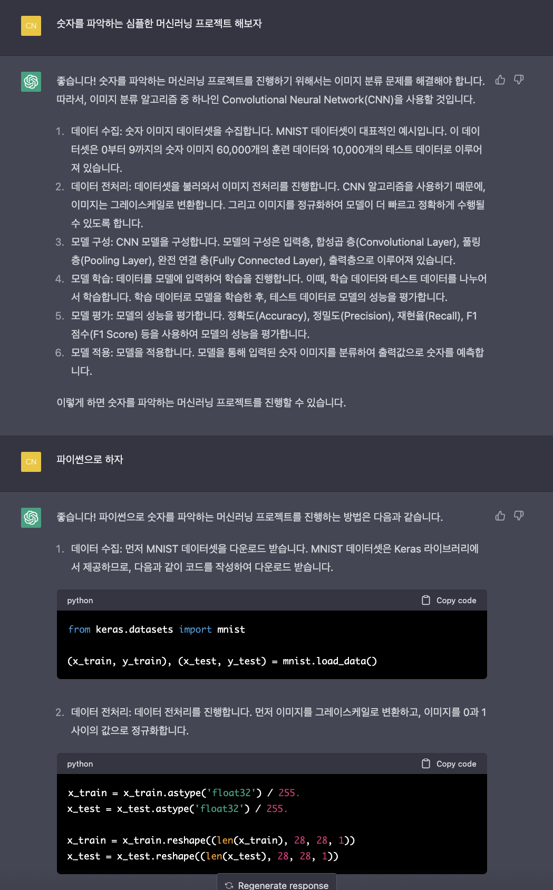

기본적인 플로우는 대략 이해를 했다.

1. 데이터를 수집하고,
2. 데이터 전처리 과정을 거쳐
3. 모델을 구성한 후
4. 학습시키고
5. 모델의 성능을 평가한 후
6. 모델을 적용해본다.

위에서부터 코드를 작성해보면서, Copilot을 통해 코드에 대한 자세한 설명을 인간의 언어로 전달받았다.

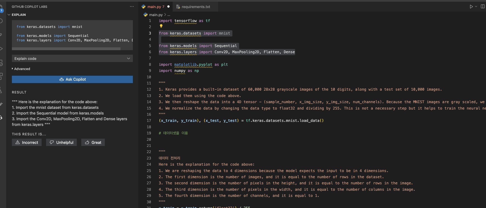

중간에 모르는 단어들과 개념들이 있었다. 코드로는 어째 저째 대충 넘어가더라도,
**핵심 개념을 모르면 의미가 없다.**

**무슨 말인지 알려줘**

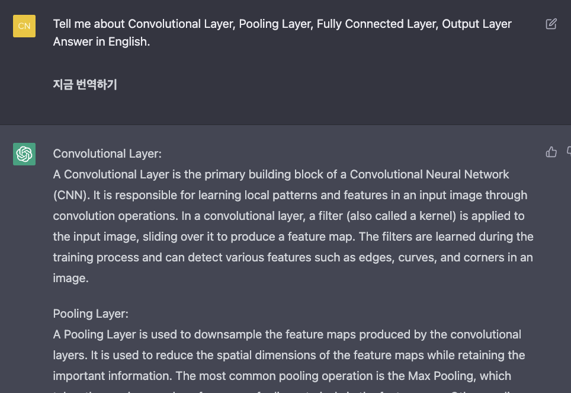

그래도 모르겠다. 텍스트로만 개념을 이해하기엔 한계가 있었다.
다시 구글검색로 돌아갔다. convolution filter는 feature를 뽑아내는 알고리즘 중 하나였다.

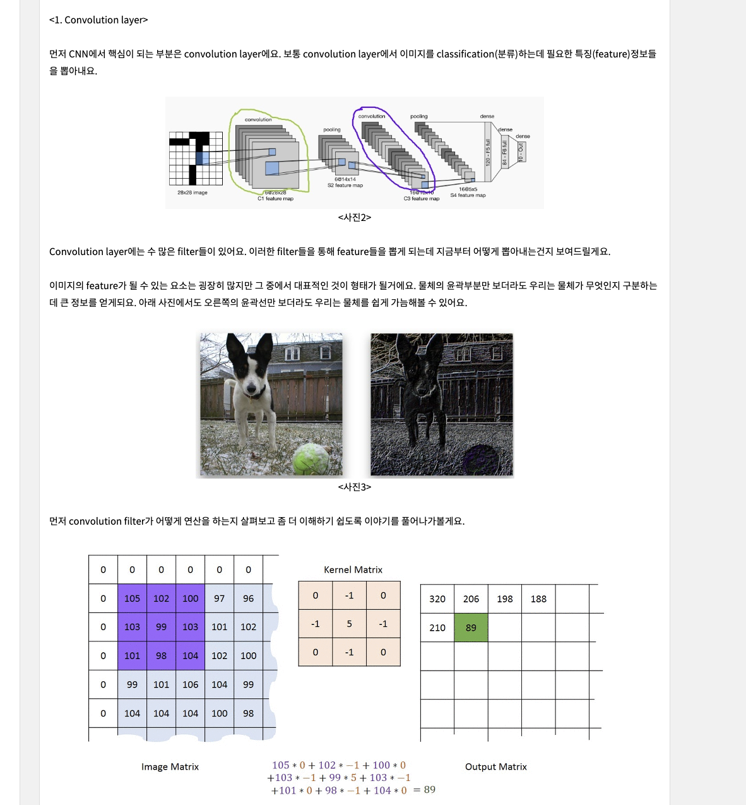

이런식으로 주석을 자동으로 달아준다.

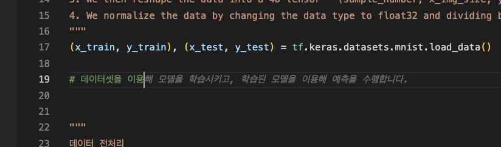

샘플 코드를 대충 이해하면서 작성해봤는데 확인할 수가 없어서 시각화가 필요했다.
주석 하나에 아래 소스를 자동완성 해주었다.

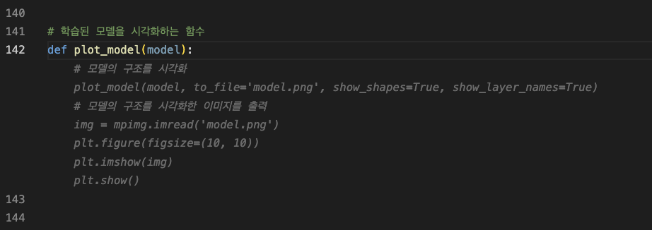

대충 이런 이미지를 받았다.

## 결론

GPT기반의 툴을 사용해보며 제5원소라는 오래된 영화가 떠올랐다.

이 영화를 보면, 5천 년 동안 잠들어있었던 주인공이 그간의 일을 배우기 위해 **시간을 극도로 압축해서 학습하는 과정**이 나온다.



인간도 이렇게 학습할 수 있을까? 기계의 도움을 받아, 지식을 확장할 수 있지 않을까.

### 업무 방식의 변화

AI도구를 활용했더니, 소스파일의 문맥을 읽고, 자동완성을 해주기 때문에 구글을 떠돌아다니는
검색 의존도가 상당히 줄어들 것으로 보였다.
그만큼 생산성도 늘어나지 않을까.

나는 단순한 코딩을 더 빨리 하기 위해서, 여러가지 방법을 사용했다.
**단축키**를 외우기도 하고, IDE 별로 자주 사용되는 소스를 **스니펫**으로 만들어서 사용했다.

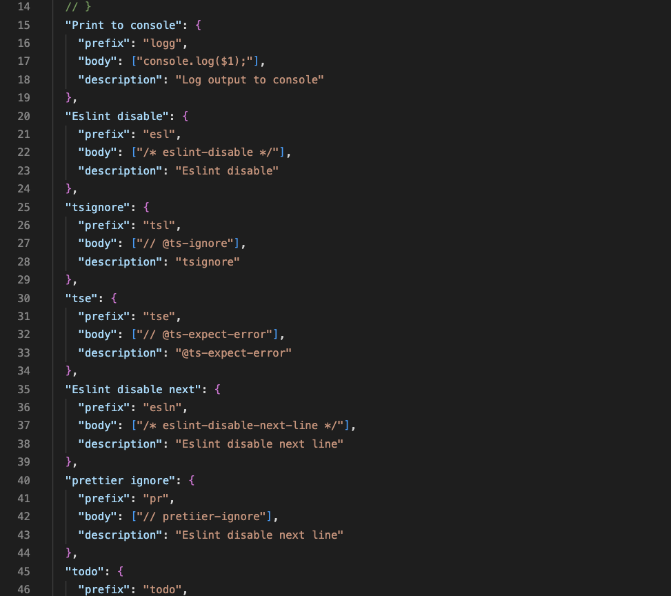

타이핑 속도는 빨라졌지만, 결국 기계를 이기지 못한다.
내가 아무리 빨라도 기계보다 빠르게 생성할 수 있을까?

해보지 않은 언어와 개념을 잘 배울 수 있을까하는 의문으로 머신러닝 미니 프로젝트로 테스트를 해보았다.
하지만, 결국은 시간을 압축하긴 어려웠다. 핵심 개념은 내 머릿속에서 구성을 해야만 했다.
그러나 초기 진입 장벽을 낮춰주었기 때문에 당연히 도움이 되는 부분도 있었다.

디자인 업무를 할 때를 생각해보자.
참고 할 이미지와 리소스를 모으고,
무형의 감각으로 조합을 해서 또 다른 산출물을 만들어 낸다.

개발도 이와 다를까?
