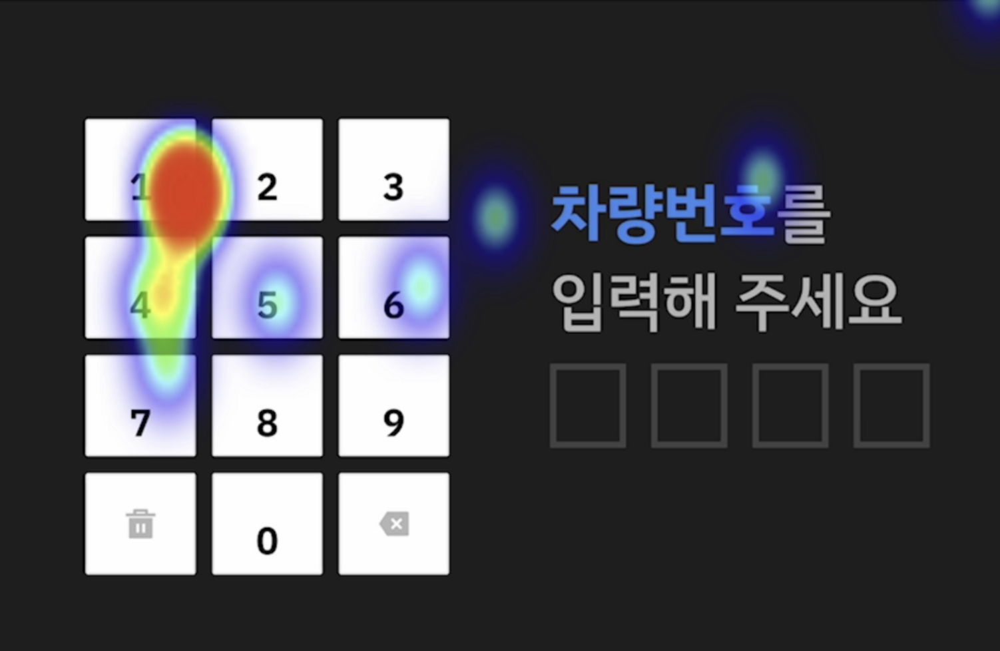

**나는 이제 프론트엔드를 좀 더 다른 관점에서 바라본다.**

바로 데이터이다. 프론트엔드 개발이라는 수요가 생기고, 시장에 정착하면서 프론트엔드 개발자의 관심은 **주로 데이터 소비에 집중되어 있었다.**

비즈니스의 요구사항으로부터 스키마가 정의되고, 백엔드로부터 데이터를 전달받아 정보를 뿌려주며, 폼을 만들어 데이터를 생성해주는 형태로도 나타났다.

나는 2022년 모빌리티 서비스를 만들어보면서 프론트엔드를 정보의 소비측면이 아니라, **데이터 생산을 하는 센서의 역할로 바라보기 시작했다.**

데이터를 사용자와 데이터 생산자의 관점으로 바라보면, 프론트엔드 개발은 **데이터 사용자**에 가까웠다.

데이터 기반의 UI, 데이터 기반의 인터렉션, 데이터 기반의 콘텐츠 구성 등 데이터의 세상에서 프론트엔드 개발자는 좀 더 적극적으로 데이터 생산에 참여할 필요가 있다.

수집된 사용자 터치 위치 데이터를 실시간으로 수집해, 시각화한 모습

지난 2022년 마지막 일주일 정도의 휴가 기간 중, 2일 정도 프로토타이핑을 해보았다. 프론트엔드 개발자가 직접 스키마를 설계하고, **사용자 데이터를 실시간으로 수집하는 시스템**을 만들어 보았다.

~~추후 위의 데모처럼 수집한 데이터를 쿠버네티스(k8s)에 띄워 마이크로서비스를 만들어 수집할 생각이다.~~

단순히 API를 통해 정해진 스키마를 그대로 뿌려주는게 아니라, 유연한 구조로 진짜 서비스에 필요한 것을 만들어내고 제시하는 역할을 해본 것이다.

엄밀히 말해, 위와 같은 작업은 전통적인 의미의 프론트엔드 개발을 하고 있지 않다고 할 수도 있다.

그렇다면, 한 번 질문을 던져보자. 내년에도, 10년 후에도 내가 지금 하고 있는 이 역할과, 일하는 모습이 그대로일까? 프론트엔드 개발자는 영원할까? 사각형 인터페이스는 영원할까?

**우리는 유연한 사고를 가져야 한다.**

지금 **정해진 룰을 깨부수고, 편견에서 벗어나 변화를 받아들이고 준비해야 한다.**
