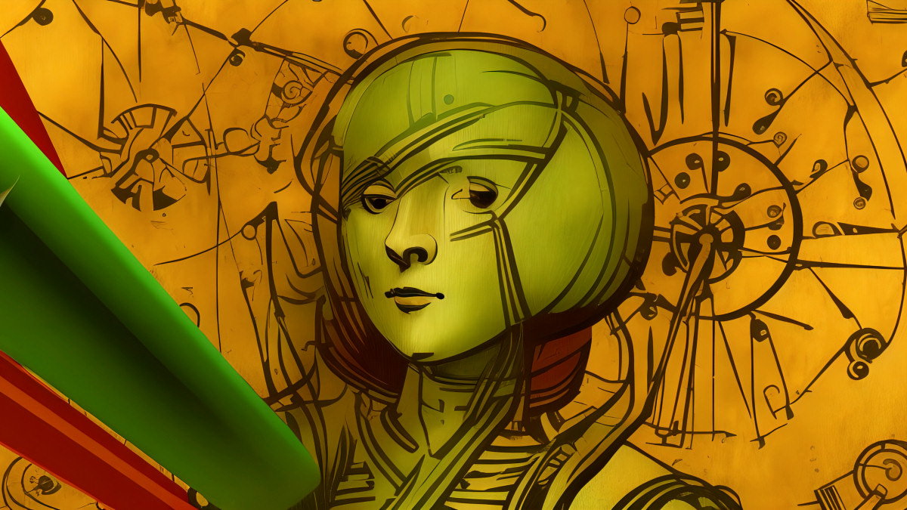

## 춘추전국시대

바야흐로 개발자의 시대이다. 개발이라는 업의 매력은 각자가 다 아리라 생각한다.

마치 춘추전국시대와 같다. 제자백가와 같은 수많은 사상가들이 유력 가문으로 흘러 가고, 가문들은 세력을 넓히는… 그 때의 모습이 바로 지금과 같지 않을까.

수많은 기업과 아이디어가 경쟁적으로 서비스를 만들어내고, 인재들은 끊임없이 흘러 들어간다. 개발자는 이 시대의 제자백가가 아닐까.

내가 원하지 않아도 하필 이 시기에 살고 있기 때문에, 시대가 원하는 방향으로 흘러가게 되는 **시대 정신**이 있다.

전통적인 의미의 기업은 디지털 트랜스포메이션을 위해 발벗고 나선다. 그 가치의 증명은 시장에 상장된 높은 가치의 기업이나, 투자자의 자본이 흘러가는 방향을 보면 이미 증명이 된 셈이다.

## 개발자는 어떤 상황에 있을까?

대부분의 개발자 포지션은 채용 시장에서 품귀 현상을 겪고 있다. 기술의 진입장벽은 나날이 낮아지고, 코딩 열풍과 각종 부트캠프로 인재가 몰려드는 반면, 채용을 원하는 기업과 구직자의 미스매치는 여전하다.

기업이 원하는 레벨은 약간의 CLI 수준으로 간단한 어플리케이션을 만들어내는 정도는 당연히 아닐 것이다. 그렇다면, 과연 개발자 수요가 공급을 따라잡지 못하는 이 상태는 어떤 신호일까?

(사진=An AI-generated image inspired by Leonardo da Vinci.)

## 내가 하는 이 일이 수 년, 수 십년 후에도 유효할까?

> 지금 내가 하고 있는 일의 30년 후의 모습은 어떨까?
여전할까? 아니 몇 년 후에도 동일할까?

위와 같은 이런 질문을 한 번 해본다. 미래의 모습은 지금과 같은 모습일까?
우리는 미래를 상상해면서 살고 있을까.
수십년 후에도 사용자는 UI를 바라보면서 정보를 해석할까?

미래를 예측하지는 못하지만, 한 가지는 확실하다.
지금과 같지 않다는 것과, 저 세상 반대편의 누군가는 끊임없이 현재의 모습을 추상화하고, 변화시킨다.

짧게는 노코드, 로우 코드 (No Code, Low Code)와 같은 버즈워드, 길게는 GPT-3와 같은 특이점이 있다.

노 코드는 유행처럼 번지는 버즈워드로 다가올 수도 있지만 사실 이 단어에는 추상화라는 메시지가 담겨 있다. 극소수의 코어 개발자는 유연하면서도 추상화된 인터페이스를 제공하고, 시장에서 니즈가 있는 비개발자, 대중, 즉 사용자가 흘러 들어가는 모습이다.

GPT-3가 개발자들 사이에서 핫하다. 특이점을 넘은 것이 분명하다.

지난 수천년 간 인간은 무질서로 보이는 자연속에서 질서를 찾는데 성공했다.
GPT-3는 인간이 만들어 낸 문법을 이해한다. 즉, 인간이 만들어낸 모든 것들은 이해한다는 것이다.
개발자들은 모두 다른 일자리를 구해야 하지 않을까? 아니, 다른 일을 알아보는건 맞을까?
